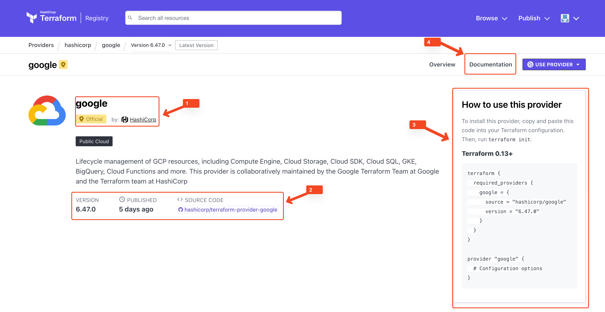

## What is a Provider?
A [provider](https://opentofu.org/docs/language/providers/) is a plugin that allows OpenTofu to interact with a specific Cloud or interfaces of an external platform.  
The provider acts as an API bridge between Terraform/OpenTofu and the target system—such as AWS, Azure, Google Cloud, Kubernetes, GitHub, etc. 

At the beginning of an OpenTofu project, at least one provider must be configured to manage resources in the corresponding infrastructure.
A list of available providers for OpenTofu can be found in the [Terraform Registry](https://registry.terraform.io/browse/providers). 
The provider defines a list of configurable resources that are specific to each platform and can be downloaded by including the provider in a `*.tf` file.
This makes the resources and configuration options available to OpenTofu.

For example, if you want to manage resources in Google Cloud Platform (GCP), you must configure the `google` provider.

1. Indicates which provider this is, in this case `google`. It also shows who provides the plugin. In this case, it's the official Hashicorp team that develops the plugin.
2. Shows a brief description of the provider, as well as the latest version, publication date, and the repository where the code is available.
3. Shows the OpenTofu code needed to configure the provider. This code must be inserted into a `*.tf` file so OpenTofu can download and use the provider.
4. References the provider's documentation, which describes the available resources and their configuration. This information is important for configuring provider-specific resources (more on this shortly).

> [!NOTE]  
> Although OpenTofu is now a separate project from Terraform, many of the basic functionalities from Terraform have been retained.
> The use of the Terraform Registry and its providers can still be used in OpenTofu to manage resources in the respective infrastructure.

## Task
For this task, the `kreuzwerker/docker` provider must first be integrated into our project. The provider was explicitly developed for use with Docker and enables OpenTofu to manage Docker resources.
In its complexity and the number of available resources, the `kreuzwerker/docker` provider is manageable and therefore well-suited for getting started with OpenTofu configuration.
1. Navigate to the directory `~/configuration_blocks/syntax-and-configuration` and create a file named `provider.tf`. OpenTofu automatically recognizes this file as a provider configuration file. You can name it anything you like, but `provider.tf` is a common convention.
    ```shell
    cd ~/configuration_blocks/syntax-and-configuration
    ```{{exec}}
2. Open the page of the [`kreuzwerker/docker` provider](https://registry.terraform.io/providers/kreuzwerker/docker/latest), click on `USE PROVIDER` and copy only the `terraform` block into the `provider.tf` file. Note that this scenario works with version `3.6.2`.
3. Before resources of the provider can be used, it must first be installed in the root directory of the project. For this, the following command must be executed in the directory where the `provider.tf` was created:
    ```shell
    tofu init
    ```{{exec}}
4. After successful installation of the provider, a `.terraform` directory should have been created in the root directory of the project. This directory contains all downloaded providers needed for the project. Among other things, you can find:
- The changelog files of the providers, which contain information about changes and new features.
- The license files of the providers, which describe the terms of use and rights of the providers.
- A README file that provides an overview of the provider and its usage.
- A binary file that contains the provider itself and is used by OpenTofu to interact with the respective infrastructure.

The contents of these files are not relevant for now, as they are only needed for the installation and use of the provider. For this scenario, they don't play a role initially.

> [!NOTE]  
> Terraform/OpenTofu is often referred to as cloud-agnostic. This statement refers to the fact that OpenTofu is able to 
> interact with various clouds through the Terraform providers without being tied to a specific platform. However, using a 
> OpenTofu provider for a specific cloud determines which resources OpenTofu can manage and binds the infrastructure to that cloud.

When you click the `Check` button after completing the exercise, the solution for `task-<number>` will be generated in the corresponding `~/configuration_blocks/syntax-and-configuration/solution-<number>` folder.