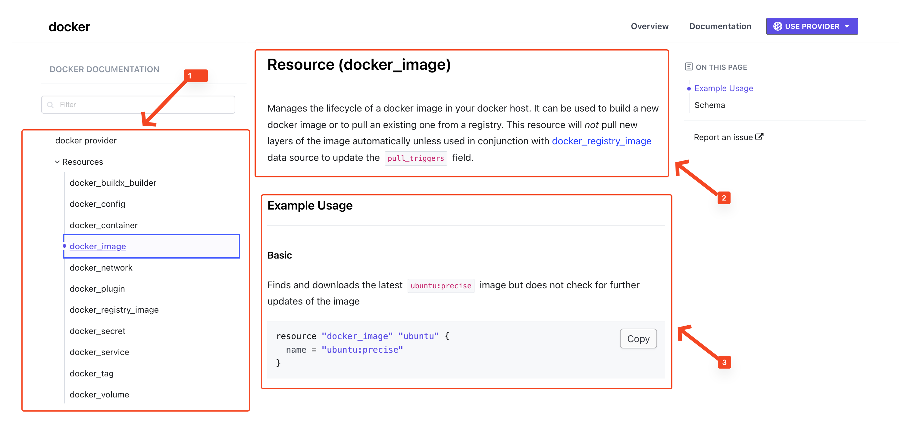

## What is a Resource?
A [resource](https://opentofu.org/docs/language/resources/) is a block type of the OpenTofu configuration language that represents either a single or multiple pieces of infrastructure. 
Resources are the fundamental building blocks of OpenTofu configurations and can represent various elements such as virtual machines, storage buckets, databases, networks, etc. 
Resources are provider-specific. This means that each provider defines its own resources, which can then be configured in OpenTofu after downloading the respective provider.
To understand this, let's examine the documentation of the [kreuzwerker/docker Provider for an Image](https://registry.terraform.io/providers/kreuzwerker/docker/latest/docs/resources/image).

1. On the left side, under the `Resources` tab, a list of all resources provided by the provider is displayed. 
2. Here it is indicated which documentation we are currently viewing with a brief description of the resource. In this case, it's the `docker_image` resource, which downloads a Docker image.
3. In this field, a minimal example configuration for the resource is displayed, which can be directly adopted into your own OpenTofu configuration. A resource configuration always consists of:
   - `resource` block, which is always specified in the form `resource "<PROVIDER>_<RESOURCE>" "<NAME>" {}`. The `<PROVIDER>_<RESOURCE>` identifies what type of resource is being configured (e.g., a Docker Image). The name `<NAME>` can be chosen freely.
   - `attributes`, which are defined within the block and represent the configuration of the resource. In this case, we can specify the name of the `docker_image` we want to download.

> [!IMPORTANT]  
> While the name `<NAME>` can be chosen freely, it must be unique. This means that within an OpenTofu configuration, no two resources with the same name may exist, as OpenTofu uses the combination of `<PROVIDER>_<RESOURCE>` and `<NAME>` as the resource identification.

## Working with Attributes
Resource attributes can be divided into three categories:
- **Required Attributes**: These attributes must be specified for the resource to be successfully created. In the documentation, these attributes are marked with `Required`.
- **Optional Attributes**: These attributes are optional and can be omitted. In the documentation, these attributes are marked with `Optional`. However, these attributes should always be checked before creation, as they often have default values that can lead to unwanted behavior. After a `tofu plan`, these default values are displayed.
- **Read-Only Attributes**: These are created only after Tofu has created the resource. They can be used in the configuration but cannot be changed. During provisioning (`tofu apply`), Tofu reads their values to reuse them. In the documentation, they are marked as Read-Only.

Additionally, attributes always have a type, which is specified in the documentation. The essential types are:
- `string`: A simple text value.
- `number`: A number, which can be either integer or with decimal places
- `bool`: A boolean value, which can be either `true` or `false`.
- `list`: A list of values, all of which must have the same type.
- `map`: A collection of key-value pairs, where the keys are strings
- `object`: A complex data type that can contain multiple attributes. These attributes can have different types and are usually enclosed in curly braces `{}`.

## Task
In this task, you will learn how to work with OpenTofu resources by creating a simple web server using Docker. You'll need to use the provider documentation to understand the required resource configurations.

**Goal**: Create two resources - a Docker image and a Docker container that serves a custom HTML page on port 80.

### Prerequisites
Make sure you have completed task-1 and have the `provider.tf` file in your `~/configuration_blocks/syntax-and-configuration` directory.

### Steps

1. **Navigate to the working directory** and create a `main.tf` file:
    ```shell
    cd ~/configuration_blocks/syntax-and-configuration
    ```{{exec}}

2. **Create the Docker Image Resource**
   - Visit the [docker_image resource documentation](https://registry.terraform.io/providers/kreuzwerker/docker/latest/docs/resources/image)
   - Study the documentation to understand the required and optional attributes
   - Create a `docker_image` resource with the following specifications:
     - Resource name: `nginx`
     - Image name: `"docker.io/library/nginx:latest"`

3. **Create the Docker Container Resource**
   - Visit the [docker_container resource documentation](https://registry.terraform.io/providers/kreuzwerker/docker/latest/docs/resources/container)
   - Study the documentation to understand how to configure a container
   - Create a `docker_container` resource with the following specifications:
     - Resource name: `web_server`
     - Container name: `"web-server"`
     - Image: Reference the image from your `docker_image` resource (use interpolation)
     - PID mode: `"host"`
     - Port configuration:
       - Internal port: `80`
       - External port: `80`
     - Upload a custom HTML file with the following content to `/usr/share/nginx/html/index.html`:
       ```html
       <!DOCTYPE html>
       <html>
       <head>
           <title>My Custom Nginx</title>
       </head>
       <body>
           <h1> Task 2: Configuration blocks </h1>
           <p> The web server was successfully configured with Open Tofu. </p>
       </body>
       </html>
       ```
     - Add a lifecycle block at the bottom of the ressource with the following exact configuration:
       ```hcl
       ressource "docker_container" "web_server" {
        # Attributes here...
         lifecycle {
           ignore_changes = [ulimit]
         }
       }
       ```
       This lifecycle block tells OpenTofu to ignore any changes to the `ulimit` attribute, which can vary between Docker environments and would otherwise cause unnecessary updates.

   > [!TIP]  
   > Look for the `upload` block in the container documentation to understand how to add custom content to your container. Use the `content` attribute with a here-document (`<<-EOT ... EOT`) syntax.

4. **Format your configuration**:
    ```shell
    tofu fmt
    ```{{exec}}

5. **Validate your configuration**:
    ```shell
    tofu validate
    ```{{exec}}

6. **Create an execution plan**:
    ```shell
    tofu plan -out=plan.tfplan
    ```{{exec}}

7. **Apply your configuration**:
    ```shell
    tofu apply plan.tfplan
    ```{{exec}}

8. **Test your web server** by accessing the web server. You can access the web server in Killercoda by following the steps in the image below. Make sure to access port `80` as defined in the `main.tf` file.
   

You should see your custom HTML page displayed!

When you click the `Check` button after completing the exercise, the solution for `task-2` will be generated in the corresponding `~/configuration_blocks/syntax-and-configuration/solution-2` folder.
