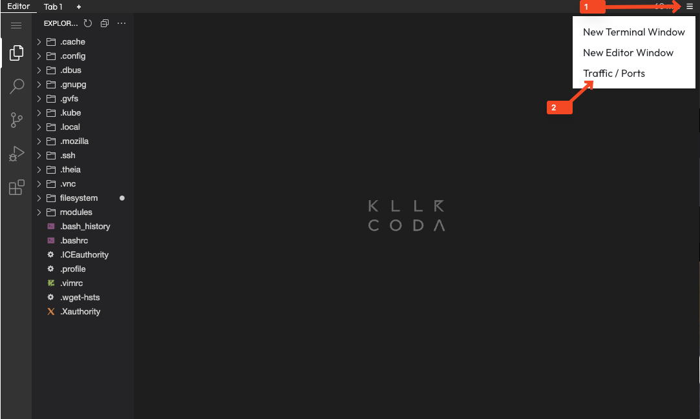

## What is a Variable?
[Variables](https://opentofu.org/docs/language/values/variables/) are block types of the OpenTofu configuration language that allow
variable input values to be used within the configuration definition.
These values are not yet fixed during the implementation of the configuration; instead, the variable definitions are built into the
configuration as placeholders. When executing the `tofu plan` or `tofu apply` command in the root directory, the values of the variables are provided
to complete the configuration, thereby generating the plan or performing the deployment.

Variables are useful for making configurations more flexible and reusable.
They can be used in various parts of the configuration to reference values
that may change or are needed in multiple resources.

The following code shows an example of a variable definition in OpenTofu:
```hcl
variable "instance_type" {
  description = "Type of the instance to create"
  type        = string
  default     = "t2.micro"
  sensitive  = false
  nullable   = false
}
```
- **description**: An optional description of the variable that explains the purpose of the variable.
- **type**: The type of the variable. The most relevant types are `string`, `number`, `bool`, `list`, `map` and `object`. More [here](https://opentofu.org/docs/language/values/variables/#type-constraints)
- **default**: An optional default value for the variable. If no value is specified, this default value is used.
- **sensitive**: An optional flag that indicates whether the value is sensitive. If `true`, the value will not be displayed in the output of `tofu plan` or `tofu apply`.
- **nullable**: An optional flag that indicates whether the variable can be `null`. If `true`, the variable can take the value `null`.

To use variables, they must be referenced in the configuration. This is done by using the syntax `var.<variablename>`. For example:
```hcl
resource "aws_instance" "example" {
  instance_type = var.instance_type
  ami           = "ami-12345678"
  tags = {
    Name = "ExampleInstance"
  }
}
```

> [!IMPORTANT]  
> In the following tasks, only the parameters `description`, `type`, and `default` will be used.

## Task

In this task, you will learn how to use variables to make your OpenTofu configuration more flexible and reusable. You'll start with a configuration that has hardcoded values and refactor it to use variables.

**Goal**: Transform hardcoded values in your configuration into variables to make it more maintainable and flexible.

### Prerequisites
Make sure you have completed the previous tasks and have the Docker provider and main.tf configured in your `~/configuration_blocks/syntax-and-configuration` directory.

### Steps

1. **Navigate to the working directory** and examine the current configuration:
    ```shell
    cd ~/configuration_blocks/syntax-and-configuration
    ```{{exec}}

2. **Create a variables.tf file**:
   Create a new file called `variables.tf` in the same directory. This file will contain all your variable definitions.

3. **Define the required variables**:
   Create variable definitions for the following values:

   **Variable 1: Image Version**
    - Variable name: `image_version`
    - Description: "Docker image name and version"
    - Type: `string`
    - Default value: `"docker.io/library/nginx:latest"`

   **Variable 2: Web Server Name**
    - Variable name: `web_server_name`
    - Description: "Name of the web server container"
    - Type: `string`
    - Default value: `"web-server"`

   **Variable 3: External Port**
    - Variable name: `external_port`
    - Description: "External port for the web server"
    - Type: `number`

   **Variable 4: Task Number**
    - Variable name: `task_number`
    - Description: "Task number to display in the HTML content"
    - Type: `string`
    - Default value: `"Task 0:"`

   **Variable 5: Web Server Message**
    - Variable name: `web_server_message`
    - Description: "Message to display on the web page"
    - Type: `string`
    - Default value: `"The web server was successfully configured with Open Tofu using variables."`

4. **Update your main.tf file**:
   Replace the hardcoded values in your `main.tf` file with the appropriate variable references using the `var.<variable_name>` syntax.

   For the HTML content in the upload block, use string interpolation with `${var.<variable_name>}` syntax to include the variables in the HTML template.

5. **Validate your configuration**:
    ```shell
    tofu validate
    ```{{exec}}

6. **Format your configuration**:
    ```shell
    tofu fmt
    ```{{exec}}

7. **Create an execution plan**: OpenTofu will ask you to provide the values for the variables without a default value. Provide the external port value as `80` when prompted.
    ```shell
    tofu plan -out=plan.tfplan
    ```{{exec}}
    
    Notice how OpenTofu shows the variable values that will be used.

8. **Apply your configuration**:
    ```shell
    tofu apply plan.tfplan
    ```{{exec}}

9.  **Test your web server** by accessing the web server. You can access the web server in Killercoda by following the steps in the image below. Make sure to access port `80` as defined in the `main.tf` file.
    

    You should see the updated content with "Task 0:" and the new message about variables.
10. Lets overwrite the `task_number`and `web_server_message` variable and switch the external port to `8080`.
    ```shell
    tofu plan -out=plan.tfplan -var="task_number=Task 3:" -var="external_port=8080" -var="web_server_message=Wow I really switched the text in here.Cool!"
    ```{{exec}}
11. **Apply the new plan**:
    ```shell
    tofu apply plan.tfplan
    ```{{exec}}
12. **Access the web server again, but on port 8080** to see the updated content with "Task 3:" and the new message about variables.
13. **Add a default value for the `external_port` variable** in your `variables.tf` file. This will allow you to run the plan without specifying the port for the next tasks.
    ```hcl
    variable "external_port" {
      description = "External port for the web server"
      type        = number
      default     = 80
    }
    ```

When you click the `Check` button after completing the exercise, the solution for `task-3` will be generated in the corresponding `~/configuration_blocks/syntax-and-configuration/solution-3` folder.
