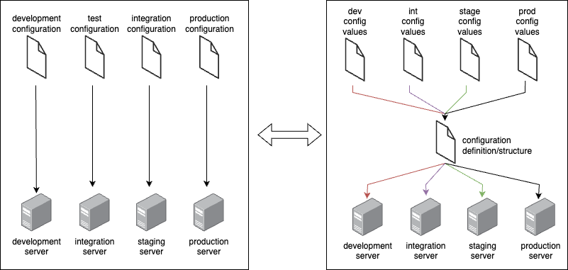

## Foreword
Environment handling with OpenTofu/Terraform is a powerful way to manage different configurations for various stages of your infrastructure lifecycle, such as development, testing or production.
In many cases you want to mirror the same infrastructure components across all environments, but slightly adjust configuration parameters or include values that are specifically for that environment.
Additionally you want to group your environment parameters on a central place to make it easier to manage them.


One option to achieve this goal is to seperate the infrastructure definition from the input parameters. While the infrastructure definition is defined at root level the actual input values are moved to specific `*.tfvars`
and referenced via variables. This ensures consistent infrastructure across all environments, reduces code duplication, and speeds up the provisioning of new environments.
One disadvantage of this method is the complicated adjustment mechanisms required when infrastructure components differ across environments.

## Task
The goal of this task is to make the existing Terraform code so flexible that it can be used to create a DEV and PROD environment with the same resource definition.
The given `main.tf` file contains the resource definitions for a web application, a database, and a Docker network, including all parameter values. To handle multiple environments, we need to do some refactoring work split into two tasks:
- Transfer the existing hard-coded values from the configuration to a `dev.tfvars` file
- Replace the hard-coded values in the configuration with variables

### Step 0: Preparation and testing the existing code
1. Run the command `tofu init` to initialize the OpenTofu environment.
2. Run the command `tofu fmt -recursive` to format the code.
3. Run the command `tofu validate` to check the syntax of the configuration.
4. Run the command `tofu plan -state="dev-state"` to create an execution plan for the infrastructure.
5. Run the command `tofu apply -state="dev-state"` to provision the infrastructure as defined in `main.tf`.

### Step 1: Transfering hard-coded values to `dev.tfvars`
1. Create the directory with the file `env/dev.tfvars`
2. Create Key-Value pairs in the file in the form `variable_name = <hardcoded_value>`. Please create the following variables and copy the hardocded values from the `main.tf` file as reference.

| Variable Name | Description |
|---------------|-------------|
| `environment` | The environment name (e.g., "dev", "prod") |
| `app_url` | The URL of the web application |
| `db_name` | The name of the database |
| `db_user` | The database user |
| `db_password` | The database password |
| `db_port` | The port for the database connection |
| `container_name` | The name of the database container |
| `image_name` | The Docker image for the web server |
| `web_container_name` | The name of the web server container |
| `web_external_port` | The external port of the web server |
| `network_name` | The name of the Docker network |
| `network_subnet` | The subnet for the Docker network |

### Step 2: Replace hard-coded values with variables
1. Create a `variable.tf` in the same directory in which the `main.tf` resides
2. For each variable you created in the previous step, define a variable block in `variable.tf`
3. Now replace the hard-coded values in `main.tf` with the variables you defined in `variable.tf`.
4. Run the commands
   - `tofu fmt -recursive`
   - `tofu validate`
5. RUn the `plan` and `apply` commands with the `-var-file` option to specify the `dev.tfvars` file:
   - `tofu plan -var-file=env/dev.tfvars -state="dev-state"`
   - `tofu apply -var-file=env/dev.tfvars -state="dev-state"`
> [!NOTE]
> The `plan` and `apply` command with the should not have any changes to be applied, because nothing has changed in the infrastructure definition, only the way how the values are provided.

### Step 3: Create a production environment
1. Create a new file `prod.tfvars` in the `env` directory.
2. Copy the content of `dev.tfvars` to `prod.tfvars`.
3. Update the values in `prod.tfvars` to reflect the production environment settings as specified in the table below:

| Variable | Value |
|----------|-------|
| `environment` | "prod" |
| `app_url` | "http://localhost:80" |
| `db_name` | "webapp_db_prod" |
| `db_user` | "webapp_user_prod" |
| `db_password` | "zP8~99^1W7zA" |
| `db_port` | 3307 |
| `container_name` | "webapp-database-prod" |
| `image_name` | "nginx:latest" |
| `web_container_name` | "webapp-nginx-prod" |
| `web_external_port` | 80 |
| `network_name` | "webapp-network-prod" |
| `network_subnet` | "172.21.0.0/16" |
4. Run the commands
   - `tofu fmt -recursive`
   - `tofu validate`
   - `tofu plan -var-file=env/prod.tfvars -state="prod-state"`
   - `tofu apply -var-file=env/prod.tfvars -state="prod-state"`

### Step 4: Conditional Resource Creation

For this task, new requirements are defined for the infrastructure configuration to demonstrate environment-specific resources:
- On the dev environment, you want to add a debug container for Redis `redis:alpine` to help with caching and session management
- In the production environment, you want to add a redundant database backup service that runs periodically to ensure data safety

Your challenge is to implement these conditional resources using the variable-based approach you've learned in the previous steps.
Please use the [Kreuzwerk Provider](https://registry.terraform.io/providers/kreuzwerker/docker/latest/docs) to see what configuration options and ressources you can use.

> [!TIP]
> Think about how you can use the `count` or `for_each` meta-arguments to conditionally create resources based on the environment.
> What could be a good indicator to determine whether a resource should be created in the dev or prod environment?

Deploy and verify both environments:
```
# Test dev environment
tofu plan -var-file=env/dev.tfvars -state="dev-state"
tofu apply -var-file=env/dev.tfvars -state="dev-state"

# Test prod environment
tofu plan -var-file=env/prod.tfvars -state="prod-state"
tofu apply -var-file=env/prod.tfvars -state="prod-state"

# Verify containers
docker ps   # Should show backup container
```

## Afterword

This task demonstrated using Terraform variables with `.tfvars` files to separate configuration from infrastructure definitions - a fundamental pattern for multi-environment deployments.