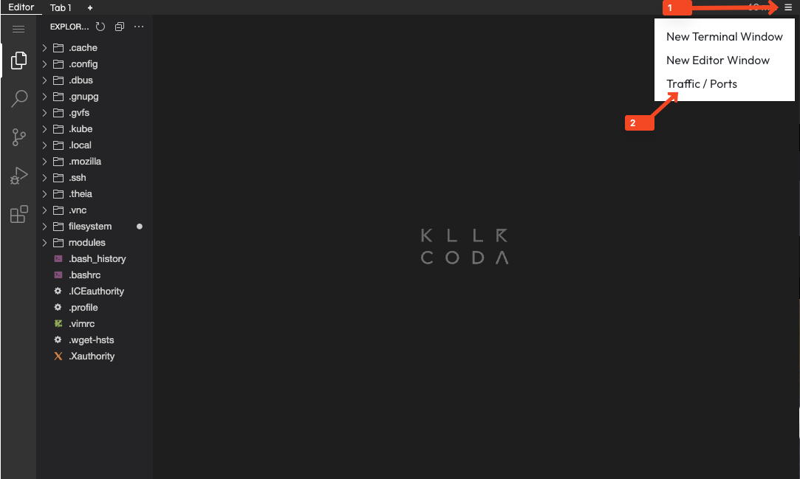

After creating a plan in the previous step, the next phase is to apply the OpenTofu configuration to actually create the infrastructure resources. 
The apply phase is where OpenTofu takes the planned actions and executes them against your infrastructure providers. In this case, it will create the Docker 
container web server based on the configuration defined in your `main.tf` file.

When you run `tofu apply`, OpenTofu will show you the same plan output you saw earlier and ask for confirmation before making any changes.
This gives you one final chance to review what will be created, modified, or destroyed.

## Task
1. In the `~/introduction-tofu/lifecycle-management/` directory, apply the previously saved plan file:
   ```shell
   tofu apply plan.tfplan
   ```{{exec}}
   This command will apply the exact plan that was saved in the `tfplan` file without asking for confirmation.

2. After the apply command completes successfully, verify that the Docker container was created:
   ```shell
   docker ps
   ```{{exec}}
   You should see a container named `web-server` running with the nginx image.
   
3. You can access the web server in Killercoda by following the steps in the image below. Make sure to access the port `80` as defined in the `main.tf` file.
   

4. After applying the configuration, OpenTofu will generate the state file inside your projects directory (if not configured otherwise). 
The state file contains all the information about the last state of the infrastructure that was provisioned by OpenTofu. 
OpenTofu uses this file to make creations, changes, and deletions of resources in future runs based on it.
To view the contents of the state file, you can use the following command:
   ```shell
   tofu show terraform.tfstate
   ```{{exec}}
   This file contains the current state of your infrastructure as managed by OpenTofu.

> [!CAUTION]
> The state file is the critical component of OpenTofu. Since it contains all the information that OpenTofu uses to manage the infrastructure, 
> the loss of this file means the loss of control over the infrastructure. For this reason, OpenTofu also creates 
> a `terraform.tfstate.backup` file to have a backup.
