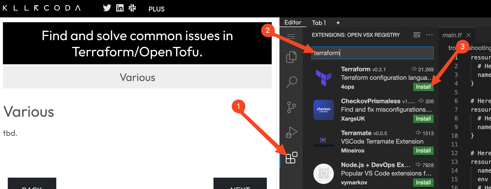

# Introduction to OpenTofu

Welcome to the OpenTofu Lifecycle scenario! Throughout this introductory scenario, you will learn the first steps with the Infrastructure as Code (IaC) tool OpenTofu. 
OpenTofu is a fork of Terraform that is being further developed by the OpenTofu community after HashiCorp changed Terraform's license from open-source to BUSL (Business Source License).

In this scenario, you will learn the fundamentals to:
 - Define your infrastructure descriptively using OpenTofu's most important components
 - Establish processes to initialize project resources with the defined scripts
 - Manage the lifecycle (such as creating, updating, or deleting) of infrastructure resources

## Prerequisites
- Basic command-line knowledge
- Familiarity with Docker concepts (containers, images)

> [!IMPORTANT]  
> Although OpenTofu and HashiCorp's Terraform are now separate projects, OpenTofu's syntax and functionality are identical to Terraform in many aspects. 
> Therefore, you can use most tutorials, documentation, and concepts for Terraform with OpenTofu and vice versa.

## Install Terraform Plugin for syntax highlighting

> **_CAUTION:_** Please wait until the environment is fully prepared before starting the exercise (`Start` button). You can monitor the preparation status in the terminal on the right side.
