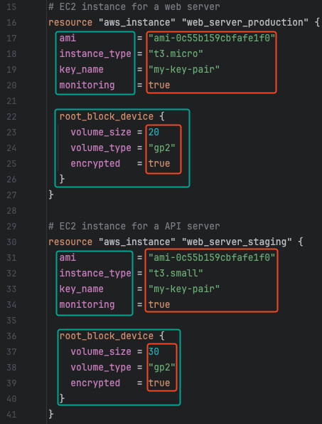

## Foreword

As your infrastructure grows in complexity, you'll quickly discover that writing OpenTofu configurations can become repetitive and error-prone. Imagine you need to deploy the same web application across multiple environments - development, staging, and production. Each environment requires the same core components: a web server, a database, and a load balancer. However, each environment has different configurations (resource sizes, instance counts, network settings, etc.).

### The Problem: Code Duplication

Let's examine the following example where two application will be deployed in AWS:

 We have two nearly identical configurations for different applications. Notice how:

- **Red areas**: Show configuration-specific values for the `aws_instance` ressource, which are different for each application
- **Green areas**: Show the ressource-specific attributes of the `aws_instance` ressource and repeat themselves in both configurations

For each new application, you would need to copy and paste the same configuration, even though only the red areas would require adjustment.
This creates a lot of redundant code in the green areas, which increases the size of your configurations and maintenance costs when attributes are changed, even though you are only interested in the red areas.

### The Solution: Modules

OpenTofu modules solve this problem by implementing the DRY (Don't Repeat Yourself) principle. A module is a reusable, self-contained package of configurations that manages a specific set of resources.
Think of modules as 'blueprints' for your infrastructure components. They define all the necessary parts of your desired infrastructure, but use variables to leave out the specific details.

### What You'll Learn

In this scenario, you'll master the following concepts:
- **Module Structure**: Best practices for organizing module code
- **Variable Design**: Creating flexible, reusable parameters
- **Output Management**: Sharing information between modules
- **Module Registry**: Using pre-built modules from the community
- **Version Control**: Managing module versions and dependencies

## Note

When you click the `Check` button after completing the exercise, the solution for `task-<number>` will be generated in the corresponding `solution-<number>` folder.

> **_CAUTION:_** Please wait until the environment is fully prepared before starting the exercise (`Start` button). You can monitor the preparation status in the terminal on the right side.