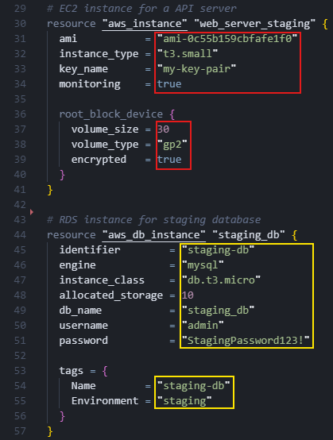

# Modules

## Foreword
Defining infrastructure with OpenTofu can become a repetitive task. For example lets analyze the following minimal OpenTofu configuration on the AWS provider:

  
  

On both sides, a web server (represented as `aws_instance`) and a database instance (represented as `aws_db_instance`) are configured for a staging and production environment. The red and orange areas on both sides show the differences in the OpenTofu configuration. As you can see, the provider-specific parameters of the AWS resources are the same on both sides, resulting in redundant code implementation. While the need for code reduction is not yet dramatic for this illustrative example, in real projects, as the code grows, so does the complexity of maintenance and the need for resource adjustment.
 
 
For this reason, OpenTofu includes the concept of [Modules](https://opentofu.org/docs/language/modules/), a feature that implements the DRY (Don't Repeat Yourself) principle. They allow you to encapsulate, parameterize and reuse configurations, making your infrastructure code more modular and maintainable. In this scenario the following learning objectives will be presented:
- Creation, usage and limitations of Modules for reusable infrastructure components
- Recommended folder structure for Modules and their benefits
- Working with the [OpenTofu Module Registry](https://opentofu.org/registry/), versioning and associated risk 

## Note

When you click the `Check` button after completing the exercise, the solution for `task-<number>` will be generated in the corresponding `solution-<number>` folder.

> **_CAUTION:_** Please wait until the environment is fully prepared before starting the exercise (`Start` button). You can monitor the preparation status in the terminal on the right side.