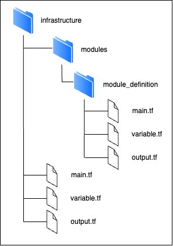

## Foreword
An OpenTofu module is a self-contained directory, separate from the root OpenTofu configuration, that contains a collection of configuration files (*.tf or *.tofu). 
These files together define a reusable, logical component of your infrastructure.



In general, a recommended module structure consists of [source](https://opentofu.org/docs/language/modules/#using-modules):
- **Ressource definitions**: The actual resources (like servers, networks, databases) that the module manages.
- **Input variables**: Parameters that allow you to customize the module’s behavior from the outside.
- **Output values**: Values that the module returns after creation, which can be used elsewhere in your OpenTofu configuration.

After defining a module, you can use it in your root configuration or other modules by referencing its source path. 
To use a module in OpenTofu, you declare a module block in your configuration. The block requires:
```hcl
   module "module_name" {
     source       = "<relative path to the module ressources>"
     variable_parameter1 = "value1"
     variable_parameter2 = "value2"
     variable_parameter3 = "value3"
   }
   ```
- **A unique name** to reference the module within your code.
- **A source argument** specifying where the module’s code is located. This can be a local path, a Git repository, or a module registry.
- **Input variables** required by the module to configure the inside ressources, passed as arguments.


## Task
Create a reusable module for a nginx container that includes a Docker image, container, and network resources. 
1. Start by creating the following folder structure:
```plaintext
module/ngnix_container/
├── main.tf
├── variables.tf
└── outputs.tf
```
2. In the `modules/nginx_container/variables.tf`, the input parameters should be defined by creating `variables` for:
   - **network_name** for the name of the network
   - **image_name** for the image name
   - **container_name** for the container name
3. In `modules/nginx_container/main.tf`, define the following resources from the [Kreuzberg provider](https://registry.terraform.io/providers/kreuzwerker/docker/latest/docs):
   - **docker_network** resource for the container's network and use the `network_name` variable
   - **docker_image** resource for the nginx image using the `image_name` variable
   - **docker_container** resource that uses the image and network as well as the `container_name` variable. Ensure to set the `network` attribute to the created network and expose port 80.
4. In your root `main.tf`, use the module:
   ```hcl
   module "nginx_latest" {
     source       = "./modules/nginx_container"
     image_name   = "nginx:latest"
     container_name = "my-nginx"
     network_name = "nginx-net"
   }
   ```
5. Run `tofu init`, `tofu fmt -recursive`, `tofu validate` and `tofu apply` to provision the container, image, and network via the module.


## Afterword:
Grouping related resources in a module makes your code more reusable and easier to manage. You can now use this module in any environment or project that needs an nginx container with its own network. 

📝 **Fun Fact:** We already encountered a module in the previous scenario. The folder in which we created the first Terraform/OpenTofu files is considered a module and termed the "root module".
