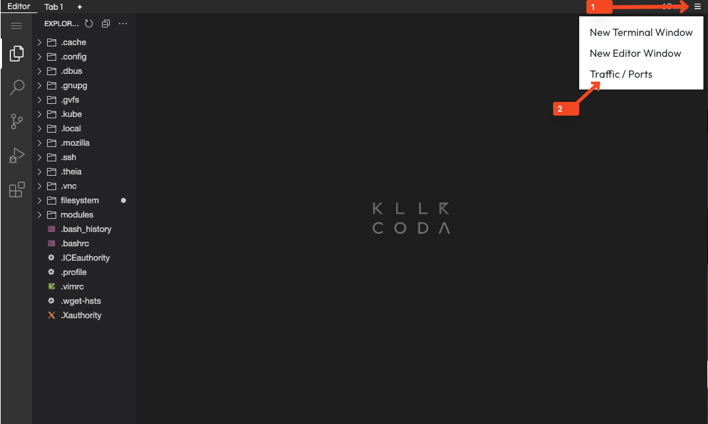

## Foreword
Modules represents a group of related resources into a reusable unit. Instead of copying and pasting the same code, you define it once in a module and use it wherever you need.
A typical OpenTofu module is simply a folder containing one or more configuration files (ending in .tf or .tofu). 
[OpenTofu recommends the following folder structure](https://opentofu.org/docs/language/modules/develop/structure/#:~:text=The%20standard%20module%20structure%20is,the%20module%20registry%2C%20and%20more.) when defining an own module:

```plaintext
my_module/
├── main.tf
├── variables.tf
└── outputs.tf
```
- **main.tf**: Defines the actual resources (like servers, networks, databases) that the module manages.
- **variables.tf**: Represents the input parameters that let you customize how the module works each time you use it.
- **outputs.tf**: Information the module gives back after it runs, which you can use elsewhere in your configuration.

## Task
Create a reusable module for a nginx container that includes a Docker image and container resources. 
1. Open the task-1 folder in the terminal
```
cd ~/modules/task-1
```{{exec}}

2. Start by creating the following folder structure:
```plaintext
modules/
└──  ngnix_container/
      ├── main.tf
      ├── variables.tf
      └── outputs.tf
```
3. In the `modules/nginx_container/variables.tf`, the input parameters should be defined by creating `variables` for:
   - **image_name** for the image name
   - **container_name** for the container name
4. In `modules/nginx_container/main.tf`, define the following resources from the [Kreuzberg provider](https://registry.terraform.io/providers/kreuzwerker/docker/latest/docs):
   - **docker_image** resource for the nginx image using the `image_name` variable
   - **docker_container** resource that uses the image and the `container_name` variable. Ensure to expose port 80.
   - Please add the following code snippet on the top of your `main.tf` file to use the correct Docker provider:
   ```hcl
   # This provider block is necessary in the module beceause the `kreuzwerker-docker` provider is not an official OpenTofu/Terraform provider.
   # Hence on initialization, OpenTofu/Terraform will assume that the ressource should be downloaded by `hashicorp/docker` which does not exist.
   # For this task we use this implementation as a workaround to be able to use the module. Best practice would be to leave out the provider 
   # block in the module so that the provider on root level is used instead.
    terraform {
      required_providers {
         docker = {
            source  = "kreuzwerker/docker"
         }
      }
    }
   ```
5. After implementing the module in the subdirectory you can start using it in your root `main.tf` with the following code snippet:
   ```hcl
   module "nginx_latest" {
     source       = "./modules/nginx_container"
     image_name   = "nginx:latest"
     container_name = "my-nginx"
   }
   ```
6.  To verify the correctness of your implementation run 
- `tofu init` 
- `tofu fmt -recursive` 
- `tofu validate`
- `tofu apply` to provision the container and image via the module.

7. You can check the status of the container with the command:
```bash
docker ps
```
8. You can access the nginx container within Killercoda on port 80:
   

### Bonus Task: Upload a new index.html file to the nginx container
1. Create a custom `index.html` file in your module directory with the following content:
   ```html
   <!DOCTYPE html>
   <html>
   <head>
       <title>My Custom Nginx Module</title>
   </head>
   <body>
       <h1>Congratulations! You have successfully created your first Tofu module!</h1>
       <p>This custom page is served by your nginx container module.</p>
   </body>
   </html>
   ```
> [!HINT]
> On the container the html file should be placed in the `/usr/share/nginx/html` directory, which is the default location for serving static files in nginx.

2. Modify your nginx_container module to upload this custom HTML file to the container. At the [kreuzwerker/docker provider](https://registry.terraform.io/providers/kreuzwerker/docker/latest/docs/resources/container), find a way to ***upload*** files to the container.
3. Apply the changes with `tofu apply` and verify that your custom page is displayed when accessing the nginx container.

📝 **Fun Fact:** 
We already encountered a module in the previous scenario. The folder in which we created the first Terraform/OpenTofu files is considered a module and termed the "root module".
