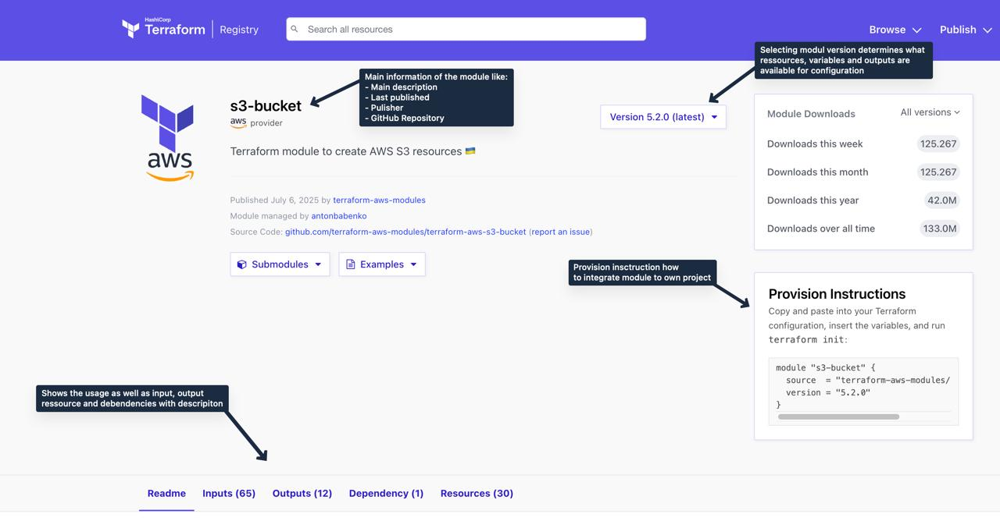

# Task 3

## Foreword

Instead of creating your own modules, you can also obtain modules from central platforms with reusable infrastructure modules, called Module Registries. Both Terraform and OpenTofu offer module registries where the community can publish, share, and discover created modules. These publicly available modules can be easily integrated, configured, and made ready for use via Terraform/OpenTofu code without having to build them from scratch.

[Source](https://registry.terraform.io/modules/terraform-aws-modules/s3-bucket/aws/latest) 

## Task
> [!IMPORTANT]
> The module used in this task is hosted in the Terraform Module Registry. For this reason, Terraform command line commands are required to download the desired module. Terraform and OpenTofu only search for modules in their own registries and cannot be easily exchanged between each other.

In this task, we will create our web server using a module from the Terraform Module Registry. The main.tf and provider.tf files, as well as the self-defined Docker module, were newly created for this task.

1. In the `main.tf` you will find a TODO comment where to place the module configuration
2. Navigate to the [Terraform Module Registry](https://registry.terraform.io/browse/modules) and search for `JamaicaBot/docker-nginx`
3. First switch the version on the website to `4.0.0` (we will look into the latest versions later on)
4. Follow the **Provision Instructions** to integrate the module into your code
5. Check which variables need to be set for this module in the `Inputs` tab
6. When finished, execute `terraform init` to download the module definition into the folder `.terraform/modules`
7. Now execute `terraform fmt -recursive`, `terraform validate` and `terraform plan`
   > **_NOTE:_** Is there anything noticeable in the plan compared to the previous task?
8. Now let's increase the module version to `5.0.0`
9. Updating a module requires a new initialization process, so therefore run `terraform init -upgrade`
10. Now execute `terraform fmt -recursive`, `terraform validate` and `terraform plan`
    > **_NOTE:_** You will encounter an error. What could the source of the error be?

## Afterword
The OpenTofu and Terraform Module Registries provide a broad selection of pre-built modules that can be seamlessly integrated into your project. A major advantage of using these modules is that they can be quickly integrated without having to build them from scratch. However, caution is advised when using these modules, as you have limited control over their content. Future updates may introduce breaking changes, and relying on outdated versions could expose your infrastructure to security vulnerabilities.

📝 **Key Concepts:**
- **Module Registry**: Central repository for reusable infrastructure modules
- **Version Pinning**: Specifying exact module versions for consistency
- **Breaking Changes**: Module updates may introduce incompatible changes
- **Security Considerations**: Using third-party modules requires trust in the source